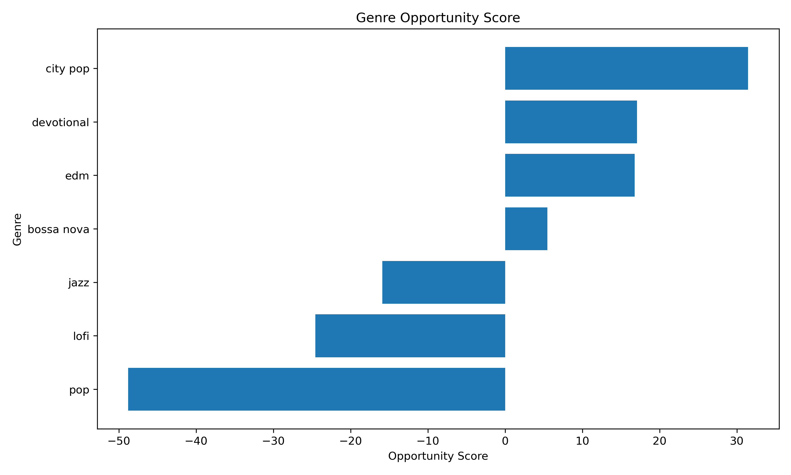
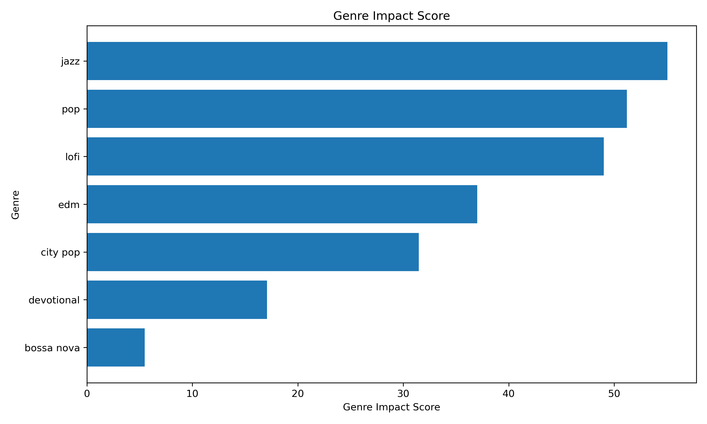
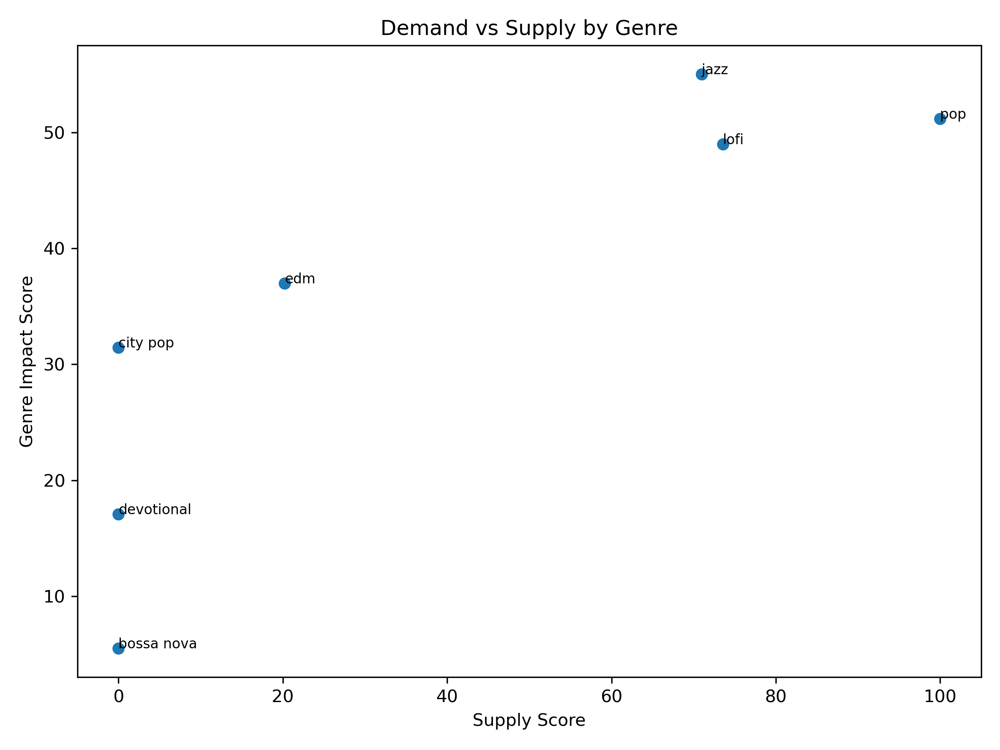

# Genre Signal Score & Opportunity Analysis

## 1. Research Goal

本阶段分析是在上一阶段 Genre Engagement Analysis 和 A/B Comparison 的基础上继续推进。之前我们主要比较不同曲风的播放量、点赞率、评论率和互动率；本阶段进一步将这些分散指标整合成一到两个可解释的 signal metrics，用于衡量每个曲风的综合影响力和未来 AI 音乐生成机会。

核心问题是：

> 哪些曲风不仅有较高市场需求，同时供给相对不足，可以作为未来 AI-generated music 的优先生成方向？

## 2. Methodology

### 2.1 Genre Impact Score

Genre Impact Score 用于衡量一个曲风发布后的综合市场影响力。该分数综合考虑播放规模、点赞率、评论率和综合互动率。

当前第一版权重设计如下：

- View Score: 45%
- Like Rate Score: 25%
- Comment Rate Score: 20%
- Engagement Rate Score: 10%

其中，播放量权重最高，因为流媒体平台的曝光规模和潜在收益通常与播放量最直接相关。点赞率和评论率用于衡量用户偏好和主动互动。综合互动率作为辅助验证指标，但由于它本身已经由点赞和评论构成，因此权重较低，以避免重复计算。

### 2.2 Supply Score

Supply Score 用 video_count 作为供给量的近似指标。一个曲风下已有视频数量越多，说明该曲风当前市场供给越高，竞争也可能越激烈。

### 2.3 Opportunity Score

Opportunity Score 用于衡量曲风的供需不平衡机会：

> Opportunity Score = Genre Impact Score - Supply Score

如果一个曲风的 Impact Score 较高，但 Supply Score 较低，说明它可能存在需求较高但供给不足的机会，更适合作为未来 AI 音乐生成和发布的优先方向。

## 3. Genre Score Summary

| Genre | Videos | Total Views | Avg Engagement Rate | Impact Score | Supply Score | Opportunity Score | Opportunity Level |
|---|---:|---:|---:|---:|---:|---:|---|
| city pop | 25 | 336,859,634 | 2.03% | 31.46 | 0.00 | 31.46 | High Opportunity |
| devotional | 25 | 1,281,137,821 | 0.72% | 17.07 | 0.00 | 17.07 | Medium Opportunity |
| edm | 50 | 2,664,221,823 | 1.59% | 37.01 | 20.24 | 16.77 | Medium Opportunity |
| bossa nova | 25 | 108,977,800 | 1.07% | 5.49 | 0.00 | 5.49 | Low Opportunity |
| jazz | 275 | 1,701,836,531 | 3.08% | 55.05 | 70.95 | -15.90 | Low Opportunity |
| lofi | 300 | 1,057,546,649 | 1.88% | 49.01 | 73.56 | -24.55 | Low Opportunity |
| pop | 725 | 153,152,349,675 | 0.93% | 51.21 | 100.00 | -48.79 | Low Opportunity |

## 4. Key Findings

### 4.1 Genres with Highest Impact Score

这些曲风代表当前 YouTube 数据中综合影响力较强的类别，即播放规模和互动表现相对更好。

- **jazz**: Impact Score = 55.05, Total Views = 1,701,836,531, Avg Engagement Rate = 3.08%
- **pop**: Impact Score = 51.21, Total Views = 153,152,349,675, Avg Engagement Rate = 0.93%
- **lofi**: Impact Score = 49.01, Total Views = 1,057,546,649, Avg Engagement Rate = 1.88%
- **edm**: Impact Score = 37.01, Total Views = 2,664,221,823, Avg Engagement Rate = 1.59%
- **city pop**: Impact Score = 31.46, Total Views = 336,859,634, Avg Engagement Rate = 2.03%

### 4.2 Genres with Highest Opportunity Score

这些曲风在综合影响力和供给水平之间存在更明显的机会空间，可能更适合未来 AI-generated music 的优先生成。

- **city pop**: Opportunity Score = 31.46, Impact Score = 31.46, Supply Score = 0.00
- **devotional**: Opportunity Score = 17.07, Impact Score = 17.07, Supply Score = 0.00
- **edm**: Opportunity Score = 16.77, Impact Score = 37.01, Supply Score = 20.24
- **bossa nova**: Opportunity Score = 5.49, Impact Score = 5.49, Supply Score = 0.00
- **jazz**: Opportunity Score = -15.90, Impact Score = 55.05, Supply Score = 70.95

### 4.3 Potential Low-Supply / High-Impact Genres

以下曲风在当前数据中表现出相对较高影响力和相对较低供给，值得进一步观察：

- **edm**: Impact Score = 37.01, Supply Score = 20.24, Opportunity Score = 16.77

## 5. Interpretation

本阶段结果说明，曲风选择不能只看播放量最高的类别。例如，某些主流曲风可能拥有非常高的播放规模，但同时供给也很高，市场竞争激烈；而某些较细分曲风虽然播放规模没有最大，但如果互动表现较好且供给相对不足，反而可能具有更高的生成机会。

因此，Genre Impact Score 更适合回答“哪个曲风影响力大”，而 Opportunity Score 更适合回答“哪个曲风值得优先生成”。这使分析从单纯描述数据，进一步转向可用于内容生产决策的 scoring system。

## 6. Current Limitations

当前分数仍然是第一版 heuristic scoring framework。权重设计基于业务逻辑，而不是最终模型参数。后续如果能够获得真实收入、完播率、分享量、收藏量或真实 A/B test 数据，可以进一步用回归、排序模型或优化方法校准权重。

此外，Supply Score 目前使用 video_count 作为供给代理变量。未来可以进一步结合 iTunes catalog count、Spotify track count、平台发布数量或地区维度供应量，形成更稳健的供给指标。

## 7. Next Steps

1. 继续细分曲风，例如 Jazz → Cafe Jazz / Study Jazz / Smooth Jazz。
2. 加入 Theme 维度，例如 Study、Sleep、Romance、Food、Hometown。
3. 构建 Genre × Theme × Market 的机会矩阵。
4. 后续基于 Suno 生成歌曲，设计真实 A/B test 来验证评分结果。

## 8. Related Figures

