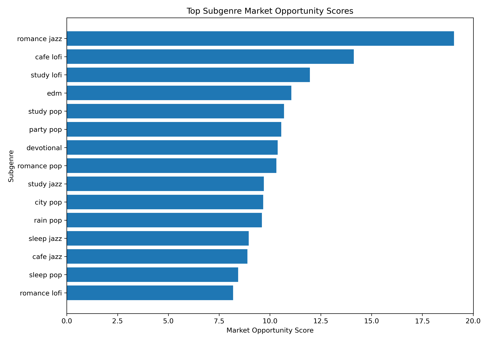
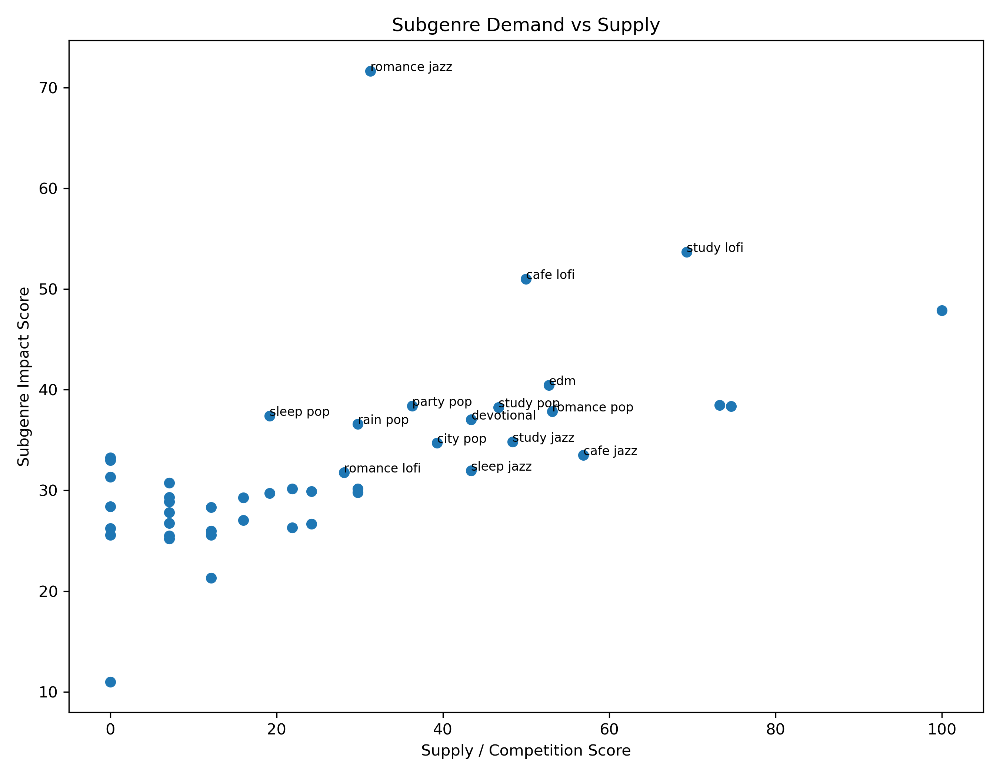
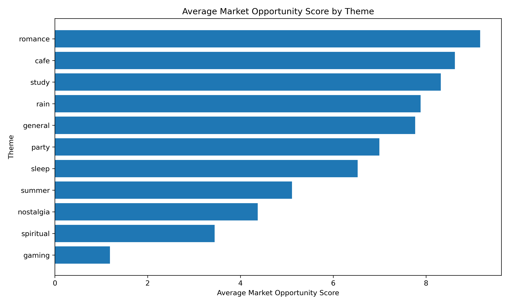
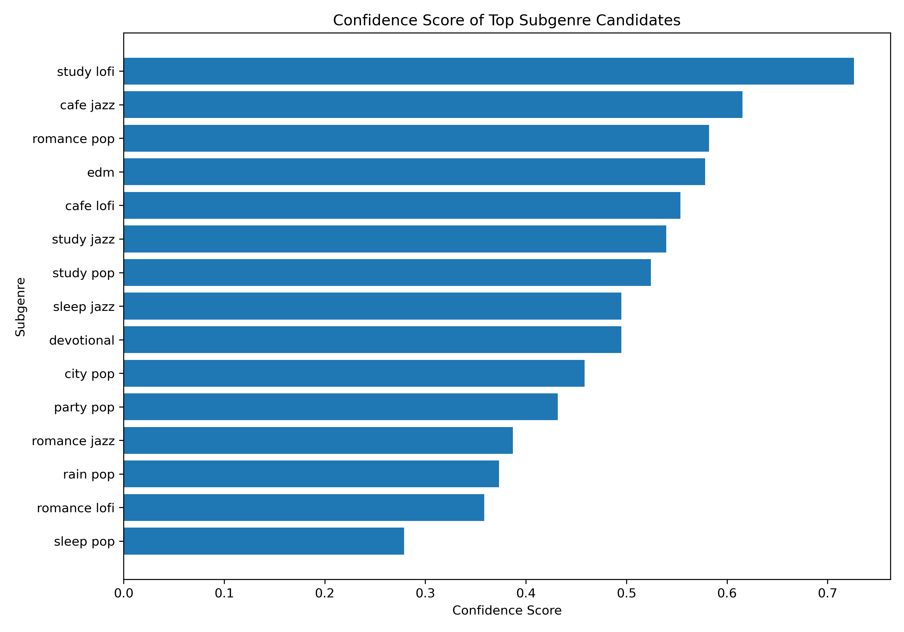

# Subgenre Market Opportunity Recommendation Report

## 1. Research Goal

本阶段分析的目标是进一步解决团队提出的核心问题：如何锁定若干需求较大、供给相对不足、可以指导未来 AI 生成音乐的曲风方向。

上一阶段的 genre-level analysis 可以判断一级曲风的整体表现，但一级曲风过于宽泛，例如 Jazz、Lofi、Pop 内部包含很多不同使用场景。因此，本阶段进一步从 YouTube title / description 中提取 theme，并构建 subgenre 维度，例如 study lofi、cafe jazz、nostalgia city pop，从而更具体地判断哪些曲风组合值得进入下一轮 AI music generation test。

## 2. Updated Scoring Logic

为了避免仅凭 1–2 个爆款视频误判市场机会，本阶段在原有 Opportunity Score 的基础上新增了 Confidence Score。

### 2.1 Impact Score

Impact Score 衡量一个细分曲风的综合需求强度，综合考虑播放量、点赞率、评论率和互动率。

### 2.2 Supply Score

Supply Score 使用 video_count 作为供给 / 竞争程度的代理变量。视频数量越多，说明该细分曲风已有供给越多，竞争越高。

### 2.3 Confidence Score

Confidence Score 用于衡量当前样本是否足够可靠。如果某个 subgenre 只有 1 个视频，即使它播放量很高，也不能直接判断为稳定机会；如果某个 subgenre 有更多视频样本，说明这个方向的市场信号更稳定。

### 2.4 Market Opportunity Score

最终 Market Opportunity Score 结合三层逻辑：需求强度、样本可信度和低竞争程度。

> Market Opportunity Score = Impact Score × Confidence Score × (1 - Supply Score / 100)

这个分数比原始 Impact - Supply 更稳健，可以减少单个爆款视频对排名的影响，更适合用于筛选未来 AI 音乐生成方向。

## 3. Top Market Opportunity Candidates

| Rank | Genre | Theme | Subgenre | Videos | Total Views | Engagement Rate | Impact | Supply | Confidence | Market Opportunity | Level |
|---:|---|---|---|---:|---:|---:|---:|---:|---:|---:|---|
| 1 | jazz | romance | romance jazz | 11 | 16,345,310 | 38.91% | 71.66 | 31.28 | 0.39 | 19.06 | Experimental Candidate |
| 2 | lofi | cafe | cafe lofi | 34 | 92,452,379 | 1.78% | 51.01 | 49.96 | 0.55 | 14.13 | Experimental Candidate |
| 3 | lofi | study | study lofi | 105 | 434,993,488 | 2.34% | 53.67 | 69.31 | 0.73 | 11.96 | Experimental Candidate |
| 4 | edm | general | edm | 40 | 2,633,239,772 | 1.44% | 40.44 | 52.73 | 0.58 | 11.05 | Experimental Candidate |
| 5 | pop | study | study pop | 28 | 3,680,495,537 | 0.50% | 38.26 | 46.68 | 0.52 | 10.70 | Experimental Candidate |
| 6 | pop | party | party pop | 15 | 2,707,817,814 | 0.87% | 38.38 | 36.30 | 0.43 | 10.55 | Experimental Candidate |
| 7 | devotional | general | devotional | 23 | 1,276,871,459 | 0.72% | 37.05 | 43.38 | 0.49 | 10.38 | Experimental Candidate |
| 8 | pop | romance | romance pop | 41 | 2,651,459,906 | 0.64% | 37.84 | 53.15 | 0.58 | 10.32 | Experimental Candidate |
| 9 | jazz | study | study jazz | 31 | 216,718,105 | 1.49% | 34.82 | 48.40 | 0.54 | 9.70 | Low Priority |
| 10 | city pop | general | city pop | 18 | 94,311,859 | 1.99% | 34.74 | 39.30 | 0.46 | 9.67 | Low Priority |

## 4. Actionable Recommendation Tiers

### 4.1 Immediate Production Candidates

当前样本中暂无同时满足高机会分和高置信度的 Immediate Production Candidate。这说明下一步需要扩大样本量，尤其是增加更多 subgenre query。

### 4.2 Experimental Candidates

这些方向具有一定机会信号，但 Confidence Score 仍然偏低，更适合作为小规模 Suno 生成和真实发布 A/B test 的候选方向，而不是直接大规模生产。

- **romance jazz**: Market Opportunity = 19.06, Confidence = 0.39, Videos = 11. 建议先做小规模测试。
- **cafe lofi**: Market Opportunity = 14.13, Confidence = 0.55, Videos = 34. 建议先做小规模测试。
- **edm**: Market Opportunity = 11.05, Confidence = 0.58, Videos = 40. 建议先做小规模测试。
- **study pop**: Market Opportunity = 10.70, Confidence = 0.52, Videos = 28. 建议先做小规模测试。
- **party pop**: Market Opportunity = 10.55, Confidence = 0.43, Videos = 15. 建议先做小规模测试。
- **devotional**: Market Opportunity = 10.38, Confidence = 0.49, Videos = 23. 建议先做小规模测试。
- **romance pop**: Market Opportunity = 10.32, Confidence = 0.58, Videos = 41. 建议先做小规模测试。

### 4.3 Saturated Markets

以下方向 Impact 可能较高，但 Supply Score 也很高，说明市场供给充足、竞争较强。不建议直接以 broad subgenre 方式进入，应进一步通过国家、语言、主题或情绪细分。

- **pop**: Impact = 47.86, Supply = 100.00, Market Opportunity = 0.00.

## 5. Theme-Level Findings

| Theme | Subgenre Count | Avg Market Opportunity | Avg Impact | Avg Confidence | Total Views | Avg Engagement Rate |
|---|---:|---:|---:|---:|---:|---:|
| romance | 5 | 9.17 | 40.67 | 0.32 | 2,840,349,586 | 8.68% |
| cafe | 4 | 8.62 | 34.29 | 0.43 | 347,806,230 | 1.06% |
| study | 5 | 8.32 | 37.36 | 0.43 | 4,345,572,808 | 1.74% |
| rain | 2 | 7.88 | 32.95 | 0.31 | 740,318,987 | 1.16% |
| general | 7 | 7.77 | 38.15 | 0.63 | 146,835,310,068 | 1.43% |
| party | 4 | 7.00 | 32.88 | 0.28 | 2,875,326,817 | 1.48% |
| sleep | 5 | 6.53 | 30.82 | 0.29 | 2,152,221,101 | 1.45% |
| summer | 6 | 5.11 | 27.92 | 0.22 | 146,079,980 | 1.21% |
| nostalgia | 4 | 4.37 | 25.24 | 0.19 | 10,219,684 | 1.66% |
| spiritual | 2 | 3.44 | 25.87 | 0.14 | 9,724,640 | 0.92% |
| gaming | 1 | 1.19 | 11.00 | 0.11 | 32 | 12.50% |

## 6. Production Guidance

当前结果说明，未来 AI music production 不应该只基于 broad genre 进行决策，而应该逐渐转向 genre + theme + market 的组合推荐。

具体来说：

1. 如果某个 subgenre 的 Market Opportunity Score 高且 Confidence Score 高，它可以进入 Immediate Production Candidate。
2. 如果某个 subgenre Opportunity 高但 Confidence 低，说明它可能只是少数视频带来的信号，应该先进入 Experimental Candidate，通过 Suno 生成少量歌曲做真实 A/B test。
3. 如果某个方向 Impact 高但 Supply 也高，说明它是红海市场，不建议直接进入，需要进一步细分主题、国家、语言或情绪。

## 7. Recommended Next Experiments

下一轮不建议直接大规模生成 broad genre 音乐，而应该围绕候选 subgenre 设计小规模实验：

- Test **romance jazz**: genre = jazz, theme = romance, market opportunity = 19.06. 建议生成 3–5 首变体，观察 views、likes、comments 和后续 revenue。
- Test **cafe lofi**: genre = lofi, theme = cafe, market opportunity = 14.13. 建议生成 3–5 首变体，观察 views、likes、comments 和后续 revenue。
- Test **study lofi**: genre = lofi, theme = study, market opportunity = 11.96. 建议生成 3–5 首变体，观察 views、likes、comments 和后续 revenue。
- Test **edm**: genre = edm, theme = general, market opportunity = 11.05. 建议生成 3–5 首变体，观察 views、likes、comments 和后续 revenue。
- Test **study pop**: genre = pop, theme = study, market opportunity = 10.70. 建议生成 3–5 首变体，观察 views、likes、comments 和后续 revenue。

## 8. Current Limitations

当前 theme classification 仍然基于 keyword matching，属于第一版规则分类。后续可以升级为 NLP embedding、topic modeling 或 LLM-based classification，以提高主题识别准确性。

当前 Supply Score 仍然只用 YouTube video_count 近似表示供给。未来可以加入 Spotify track count、iTunes catalog count、TikTok video count、发布时间窗口和国家维度，形成更完整的供需矩阵。

最后，当前结果仍然属于 observational analysis。真正的 A/B test 需要用 Suno 生成可控歌曲，并控制 title format、cover style、release time、language、country 和 promotion level。

## 9. Related Figures

