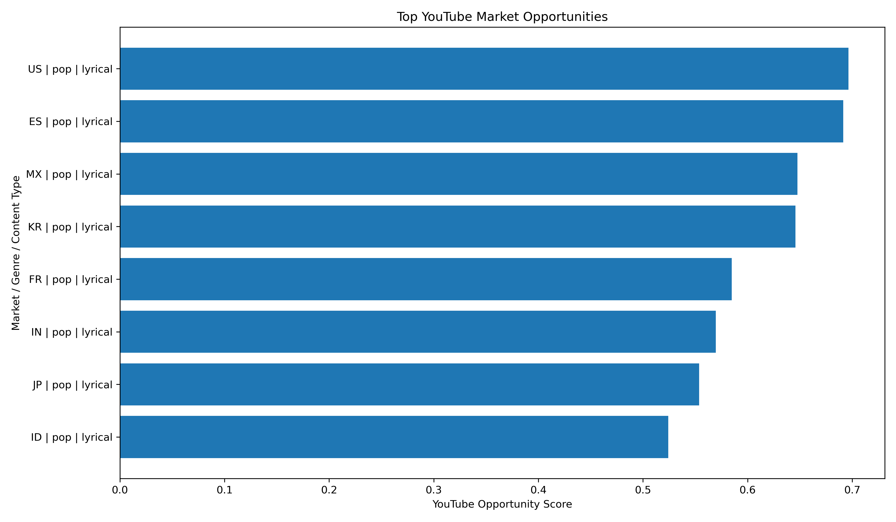
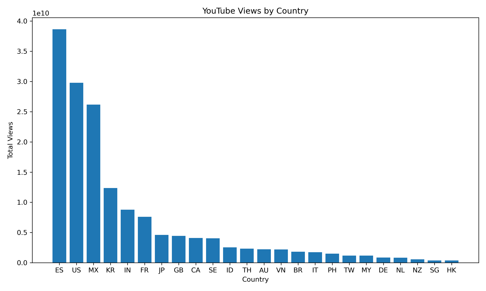
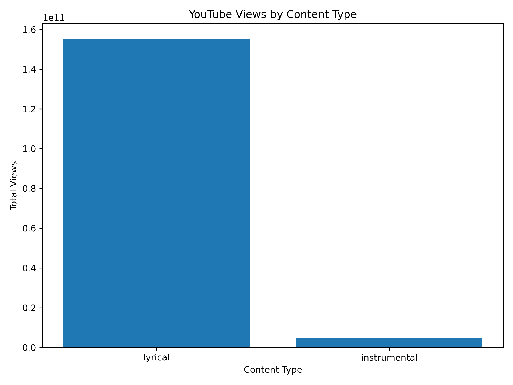
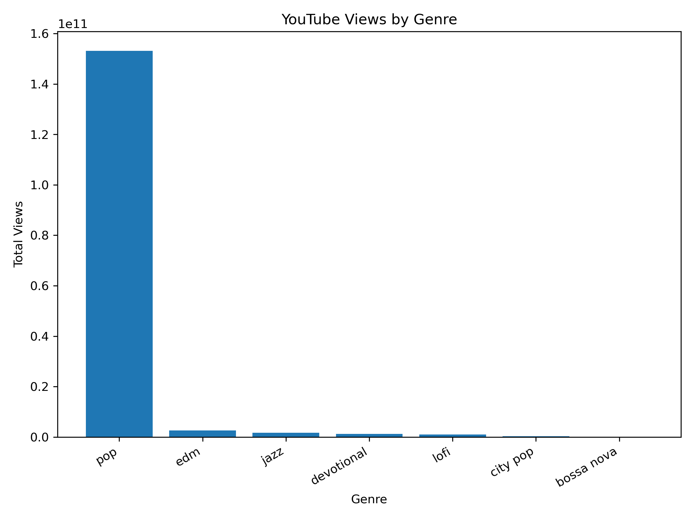

# YouTube Public Market Analysis for AI-Generated Music

## 1. Purpose

This report uses public YouTube video metrics to evaluate early audience-demand signals for AI-generated music across countries, genres, and content formats.

The current goal is not to estimate exact streaming revenue. Instead, the goal is to identify which markets and content types may be more promising for early-stage release testing.

## 2. Data Source

The dataset was collected through the YouTube Data API using a predefined search matrix of country, genre, content type, lyric style, language, and query.

The main metrics include:

- video count
- total views
- median views
- total likes
- total comments
- average like rate
- average comment rate
- YouTube opportunity score

The opportunity score gives the highest weight to view volume, followed by median views and engagement rates. This matches the current business priority: audience discovery and market validation first, revenue optimization later.

## 3. Top YouTube Market Opportunities

The strongest market-content combination in the current sample is:

- Country: United States (US)
- Genre: pop
- Content type: lyrical
- Lyric style: english
- Query: English pop song
- YouTube opportunity score: 0.696

### Top 10 Market Opportunities

| country_code   | country_name   | genre   | content_type   | lyric_style    | query                  | total_views    | median_views   |   avg_like_rate |   avg_comment_rate |   youtube_opportunity_score |
|:---------------|:---------------|:--------|:---------------|:---------------|:-----------------------|:---------------|:---------------|----------------:|-------------------:|----------------------------:|
| US             | United States  | pop     | lyrical        | english        | English pop song       | 28,436,722,900 | 617,089,497    |          0.0052 |             0.0002 |                       0.696 |
| ES             | Spain          | pop     | lyrical        | local_language | Spanish pop song Spain | 31,745,865,978 | 241,655,742    |          0.0071 |             0.0002 |                       0.691 |
| MX             | Mexico         | pop     | lyrical        | local_language | Mexican pop song       | 19,289,374,269 | 102,466,036    |          0.0063 |             0.0001 |                       0.648 |
| KR             | South Korea    | pop     | lyrical        | local_language | Korean pop song        | 12,200,630,320 | 190,840,744    |          0.0101 |             0.0009 |                       0.646 |
| FR             | France         | pop     | lyrical        | local_language | French pop song        | 7,542,836,539  | 38,299,019     |          0.0098 |             0.0003 |                       0.585 |
| MX             | Mexico         | pop     | lyrical        | humorous       | Spanish funny song     | 6,858,342,392  | 22,677,685     |          0.0165 |             0.0005 |                       0.579 |
| ES             | Spain          | pop     | lyrical        | humorous       | Spanish funny song     | 6,851,765,726  | 22,677,685     |          0.0141 |             0.0005 |                       0.577 |
| IN             | India          | pop     | lyrical        | local_language | Hindi pop song         | 7,218,745,306  | 26,100,839     |          0.0052 |             0.0001 |                       0.57  |
| JP             | Japan          | pop     | lyrical        | local_language | Japanese pop song      | 4,065,529,464  | 26,606,926     |          0.0186 |             0.0005 |                       0.554 |
| ID             | Indonesia      | pop     | lyrical        | local_language | Indonesian pop song    | 2,535,273,238  | 58,302,717     |          0.0055 |             0.0004 |                       0.524 |

## 4. Country-Level Findings

The strongest country-level signal in the current sample is:

- Country: Spain (ES)
- Total views: 38,638,413,973
- Median views: 5,570,955

### Country Summary

| country_code   | country_name   |   video_count | total_views    | median_views   | total_likes   | total_comments   |   avg_like_rate |   avg_comment_rate |
|:---------------|:---------------|--------------:|:---------------|:---------------|:--------------|:-----------------|----------------:|-------------------:|
| ES             | Spain          |            75 | 38,638,413,973 | 5,570,955      | 195,268,198   | 8,359,921        |      0.0120823  |        0.000357739 |
| US             | United States  |           125 | 29,782,390,189 | 3,115,551      | 184,042,107   | 9,664,170        |      0.00788442 |        0.00022741  |
| MX             | Mexico         |            75 | 26,167,452,867 | 7,477,839      | 135,267,042   | 6,522,874        |      0.0123397  |        0.000310269 |
| KR             | South Korea    |            75 | 12,371,218,573 | 3,272,393      | 137,294,477   | 22,886,981       |      0.0675098  |        0.000903677 |
| IN             | India          |            75 | 8,792,921,257  | 16,089,778     | 41,947,856    | 1,169,280        |      0.00694238 |        0.000229867 |
| FR             | France         |            75 | 7,607,807,297  | 876,566        | 50,565,123    | 1,467,886        |      0.0145615  |        0.000506044 |
| JP             | Japan          |           100 | 4,600,505,411  | 1,925,315      | 34,535,844    | 1,328,542        |      0.0183874  |        0.000550035 |
| GB             | United Kingdom |            75 | 4,438,167,438  | 1,818,011      | 27,467,694    | 628,784          |      0.00914546 |        0.000349732 |
| CA             | Canada         |            50 | 4,089,763,038  | 809,877        | 31,488,868    | 1,248,696        |      0.0157202  |        0.00512988  |
| SE             | Sweden         |            50 | 4,034,468,110  | 9,759,002      | 26,021,847    | 1,145,066        |      0.0119453  |        0.000675927 |
| ID             | Indonesia      |            50 | 2,541,897,828  | 882,661        | 9,911,518     | 520,554          |      0.00843527 |        0.000486362 |
| TH             | Thailand       |            50 | 2,320,641,735  | 1,441,172      | 11,248,057    | 327,433          |      0.0120772  |        0.000562516 |
| AU             | Australia      |            50 | 2,218,935,766  | 470,677        | 12,079,174    | 482,822          |      0.0178728  |        0.00430916  |
| VN             | Vietnam        |            50 | 2,192,476,905  | 4,479,468      | 17,843,185    | 2,099,398        |      0.00842829 |        0.000695685 |
| BR             | Brazil         |            75 | 1,820,187,590  | 710,297        | 8,862,888     | 428,953          |      0.016596   |        0.00132403  |
| IT             | Italy          |            50 | 1,750,179,288  | 1,567,431      | 6,991,939     | 187,268          |      0.00939899 |        0.000328445 |
| PH             | Philippines    |            50 | 1,495,082,354  | 6,226,515      | 5,885,817     | 396,740          |      0.00413496 |        0.000177895 |
| TW             | Taiwan         |            50 | 1,189,649,644  | 246,813        | 4,359,234     | 126,894          |      0.0149198  |        0.00106441  |
| MY             | Malaysia       |            25 | 1,189,294,700  | 34,096,080     | 6,242,163     | 441,927          |      0.00687424 |        0.000857157 |
| DE             | Germany        |            75 | 872,797,517    | 331,017        | 6,408,817     | 172,226          |      0.0181468  |        0.00312678  |
| NL             | Netherlands    |            50 | 844,604,909    | 5,531,435      | 6,547,923     | 166,203          |      0.0117931  |        0.000501812 |
| NZ             | New Zealand    |            25 | 571,494,926    | 6,202,177      | 5,859,139     | 168,061          |      0.00730544 |        0.00030837  |
| SG             | Singapore      |            25 | 391,157,587    | 4,456,021      | 5,412,798     | 134,591          |      0.0162906  |        0.000939367 |
| HK             | Hong Kong      |            25 | 381,421,031    | 2,476,141      | 1,075,627     | 63,355           |      0.00469604 |        0.000186947 |

## 5. Content-Type Findings: Instrumental vs. Lyrical

The stronger content type in the current YouTube sample is:

- Content type: lyrical
- Total views: 155,308,963,225
- Median views: 13,056,480

### Content Type Summary

| content_type   |   video_count | total_views     | median_views   | total_likes   | total_comments   |   avg_like_rate |   avg_comment_rate |
|:---------------|--------------:|:----------------|:---------------|:--------------|:-----------------|----------------:|-------------------:|
| lyrical        |           750 | 155,308,963,225 | 13,056,480     | 930,853,785   | 58,746,483       |      0.00951717 |        0.000548491 |
| instrumental   |           675 | 4,993,966,708   | 808,345        | 41,773,550    | 1,392,142        |      0.0208906  |        0.00142085  |

### Interpretation

The current sample suggests that lyrical content has much higher total YouTube visibility than instrumental content. However, this should not be interpreted as a final causal conclusion that lyrics always outperform instrumental music.

A key limitation is that the current lyrical queries are mostly pop and local-language pop, while the instrumental queries are mostly jazz and lofi. Therefore, the result reflects both content-type effects and genre effects. A cleaner A/B test should compare the same genre with and without lyrics, such as jazz instrumental versus jazz vocal, or lofi instrumental versus lofi with vocals.

## 6. Genre-Level Findings

The strongest genre-level signal in the current sample is:

- Genre: pop
- Total views: 153,152,349,675
- Median views: 10,241,542

### Genre Summary

| genre      |   video_count | total_views     | median_views   | total_likes   | total_comments   |   avg_like_rate |   avg_comment_rate |
|:-----------|--------------:|:----------------|:---------------|:--------------|:-----------------|----------------:|-------------------:|
| pop        |           725 | 153,152,349,675 | 10,241,542     | 910,846,201   | 58,212,107       |      0.0087864  |        0.000524449 |
| edm        |            50 | 2,664,221,823   | 4,308,091      | 18,349,454    | 715,025          |      0.0151688  |        0.00069453  |
| jazz       |           275 | 1,701,836,531   | 990,044        | 18,893,761    | 450,759          |      0.0302776  |        0.000488224 |
| devotional |            25 | 1,281,137,821   | 25,030,482     | 8,122,428     | 346,569          |      0.00686801 |        0.000334894 |
| lofi       |           300 | 1,057,546,649   | 331,835        | 10,735,984    | 320,733          |      0.0161956  |        0.00263464  |
| city pop   |            25 | 336,859,634     | 807,120        | 4,970,918     | 83,527           |      0.019542   |        0.000786662 |
| bossa nova |            25 | 108,977,800     | 2,499,589      | 708,589       | 9,905            |      0.0106075  |        0.00011182  |

### Interpretation

Pop dominates the current YouTube public-search sample, especially in local-language markets such as Brazil, Mexico, India, and Indonesia. Jazz and lofi show lower total view volume, but they may still be useful for niche positioning, background listening, study, work, café, and relaxation contexts.

## 7. Implications for AI-Generated Music Release Strategy

Based on the current YouTube sample, the strongest short-term direction is to prioritize local-language lyrical pop in high-volume markets such as Mexico, Brazil, India, and Indonesia.

For niche testing, Japanese jazz instrumental and Brazilian jazz instrumental are still worth testing because jazz may represent a smaller but more differentiated market. These tracks may not maximize immediate volume, but they may help identify underserved audience segments.

## 8. Business Interpretation

At the current stage, view volume is more important than direct monetization. Early AI-generated music releases may not generate meaningful payout on major streaming platforms if the stream volume is low. Therefore, the first release strategy should optimize for discovery, reach, and engagement.

Revenue should be treated as a secondary validation metric and should be added later through distributor reports, YouTube Studio / YouTube Analytics, TikTok performance data, Facebook/Instagram reporting, and Chinese platform dashboards such as Tencent Music and NetEase Cloud Music.

## 9. Limitations

Several limitations should be noted:

1. YouTube search results are not a controlled experiment. They reflect public visibility, existing popularity, and YouTube ranking behavior.
2. The dataset captures public YouTube video metrics, not exact YouTube Music streaming revenue.
3. Lyrical and instrumental categories are not perfectly balanced by genre.
4. High total views may reflect existing superstar content rather than an easy market entry opportunity.
5. TikTok, Spotify, Facebook, Luna, Tencent Music, and NetEase Cloud Music still require manual sampling or distributor dashboard data.

## 10. Next Steps

The next step is to add TikTok manual sampling and platform revenue observations.

Recommended next datasets:

- TikTok manual observations: views, likes, comments, shares, search query, country/language signal
- Spotify / DistroKid observations: streams, revenue, platform payout notes
- YouTube Music / YouTube Analytics: country-level revenue where available
- Tencent Music and NetEase Cloud Music: plays, comments, favorites, revenue per play
- Facebook/Instagram and Luna: distributor-level plays and revenue

The next analytical step is to combine public engagement data and manual revenue observations into a platform-market recommendation table.
